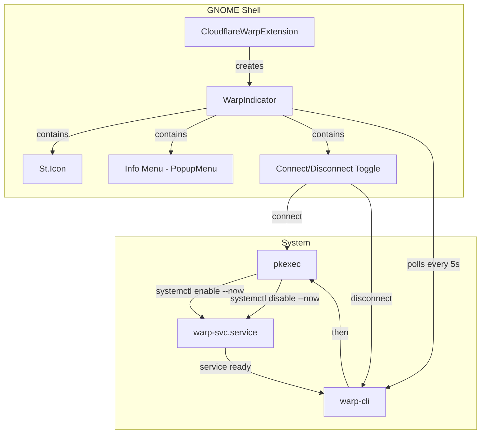
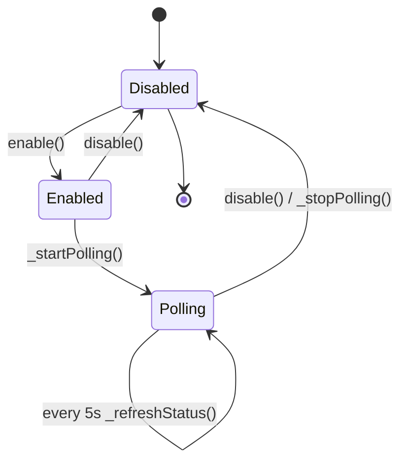
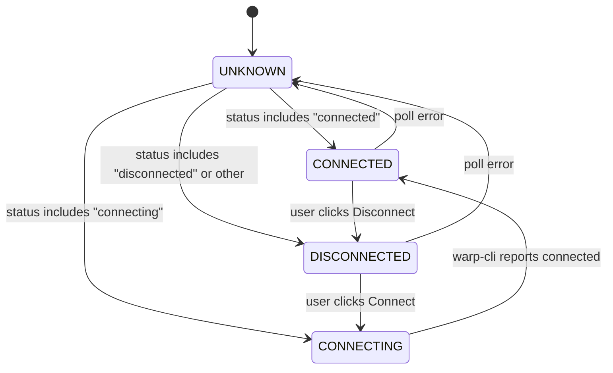
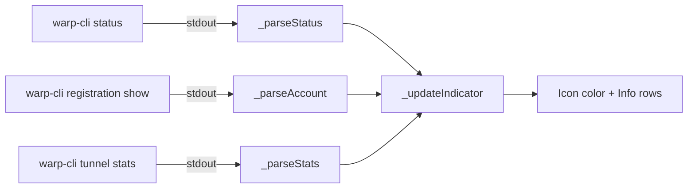

# Architecture

## Overview

The extension is a single-file GNOME Shell panel button (`extension.js`) that communicates with Cloudflare WARP through the `warp-cli` command-line tool and manages the `warp-svc` systemd service.

## Component Diagram



## Extension Lifecycle



## Key Classes

### `CloudflareWarpExtension`

The entry point. Extends `Extension` from GNOME Shell's extension API. Responsible for creating and destroying the `WarpIndicator` on enable/disable.

### `WarpIndicator`

A `PanelMenu.Button` subclass registered via `GObject.registerClass`. Contains all UI and logic:

| Responsibility | Method(s) |
|----------------|-----------|
| Panel icon | `_setIconName()`, `_updateIndicator()` |
| Info popup (left-click) | `_buildInfoMenu()`, `_addInfoRow()`, `_updateInfoRow()` |
| Action menu (toggle) | `_buildActionMenu()`, `_connectWarp()`, `_disconnectWarp()` |
| Status polling | `_startPolling()`, `_stopPolling()`, `_refreshStatus()` |
| CLI interaction | `_runWarpCli()`, `_runWarpCommand()`, `_runCommandAsync()` |
| Output parsing | `_parseStatus()`, `_parseAccount()`, `_parseStats()` |

## State Machine



## Data Flow



## File Structure

```
cloudflare-warp-indicator@dnviti/
  extension.js       -- All extension logic (single file)
  metadata.json      -- Extension metadata (uuid, name, shell versions)
  stylesheet.css     -- CSS classes for icon colors and info panel
  icons/
    warp-connected-symbolic.svg
    warp-disconnected-symbolic.svg
```
