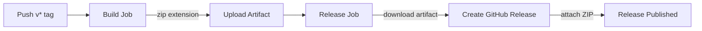

# Deployment

## Building the Extension ZIP

### Local Build

```bash
cd /path/to/cloudflare-warp-gnome-plugin
zip -r cloudflare-warp-indicator@dnviti.shell-extension.zip \
  metadata.json \
  extension.js \
  stylesheet.css \
  icons/
```

The ZIP must contain these files at the root level (no parent directory wrapper).

## CI/CD Pipeline

### GitHub Actions Workflow

**File:** `.github/workflows/ci.yml`

The pipeline triggers **only on tag pushes** matching `v*` (e.g., `v1.0.0`).



### Creating a Release

```bash
# Tag the release
git tag -a v1.0.0 -m "Release v1.0.0"
git push origin v1.0.0
```

This triggers the workflow which:
1. Checks out the code
2. Reads UUID and version from `metadata.json`
3. Builds the ZIP named `cloudflare-warp-indicator@dnviti.shell-extension.zip`
4. Uploads it as a build artifact
5. Creates a GitHub Release with auto-generated release notes
6. Attaches the ZIP to the release

## Publishing to GNOME Extensions

### First-Time Upload

1. Create an account at [extensions.gnome.org](https://extensions.gnome.org)
2. Go to [extensions.gnome.org/upload/](https://extensions.gnome.org/upload/)
3. Select the `.zip` file and submit
4. Wait for manual review (typically a few days to two weeks)

### Updating an Existing Extension

1. Increment `"version"` in `metadata.json` (integer: 1 -> 2 -> 3...)
2. Build a new ZIP
3. Upload at the same URL -- the site detects the UUID and creates a new version
4. Each update goes through review again

### Review Criteria

GNOME reviewers check for:
- No unsafe `eval()` or dynamic code execution
- Proper cleanup in `destroy()` (timers, signals, child objects)
- No bundled libraries that duplicate GNOME platform libs
- Correct use of the Extension API for the declared `shell-version`
- No network requests to external services (beyond local CLI tools)

## Installing from ZIP

```bash
# Via GNOME Extensions CLI
gnome-extensions install cloudflare-warp-indicator@dnviti.shell-extension.zip

# Manual extraction
mkdir -p ~/.local/share/gnome-shell/extensions/cloudflare-warp-indicator@dnviti
unzip cloudflare-warp-indicator@dnviti.shell-extension.zip \
  -d ~/.local/share/gnome-shell/extensions/cloudflare-warp-indicator@dnviti
```
